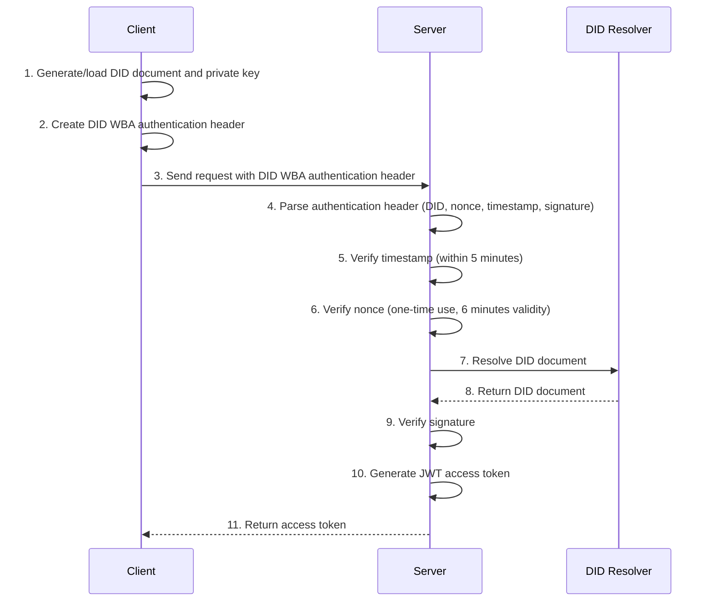
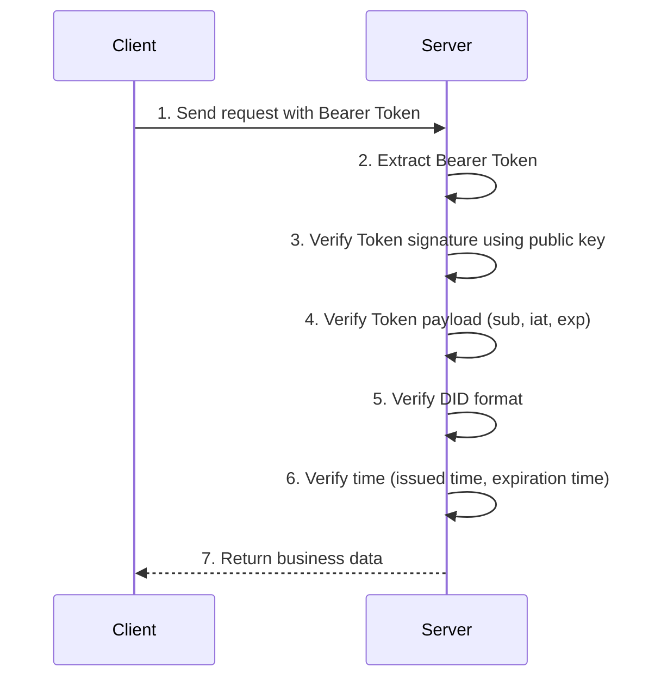
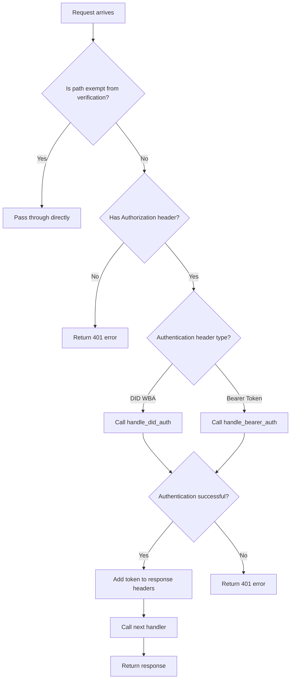

# DID WBA System Technical Documentation

## 1. System Overview

This system is an identity authentication solution based on the DID WBA (Decentralized Identifier Web Based Authentication) protocol, built with the FastAPI framework, supporting both client and server functionalities. The system implements two authentication mechanisms: DID WBA initial authentication and JWT Bearer Token subsequent authentication.

### 1.1 Technology Stack
- **Backend Framework**: FastAPI
- **Identity Authentication**: DID WBA + JWT Bearer Token
- **Encryption Algorithm**: RS256 (RSA with SHA-256)
- **HTTP Client**: aiohttp
- **Configuration Management**: Pydantic Settings

## 2. System Architecture

### 2.1 Directory Structure
```
did-wba-example/
├── did_server.py           # Program entry point, supports client and server modes
├── api/                    # API routing modules
│   ├── auth_router.py      # Authentication-related APIs
│   ├── did_router.py       # DID document management APIs
│   └── ad_router.py        # Advertisement data APIs (requires authentication)
├── auth/                   # Authentication and authorization modules
│   ├── did_auth.py         # DID WBA authentication core implementation
│   ├── token_auth.py       # JWT Token authentication
│   ├── auth_middleware.py  # Authentication middleware
│   ├── custom_did_resolver.py  # Custom DID resolver
│   └── jwt_keys.py         # JWT key management
├── core/                   # Core configuration and application initialization
│   ├── app.py              # FastAPI application creation
│   └── config.py           # System configuration
├── utils/                  # Utility functions
└── did_keys/               # DID documents and private key storage directory
```

### 2.2 Core Components

#### 2.2.1 Application Layer (core/app.py)
- Create and configure FastAPI application
- Register CORS middleware
- Register authentication middleware
- Include all API routes

#### 2.2.2 Authentication Layer (auth/)
- **DID Authentication Module**: Handles DID WBA protocol authentication
- **Token Authentication Module**: Handles JWT Bearer Token authentication
- **Authentication Middleware**: Unified handling of identity verification for all requests
- **Custom DID Resolver**: Resolves local DID documents

#### 2.2.3 API Layer (api/)
- **Authentication APIs**: Provide DID WBA authentication and token verification interfaces
- **DID Management APIs**: Provide storage and retrieval of DID documents
- **Business APIs**: Business interfaces requiring identity verification

## 3. Client Functionality Details

### 3.1 Main Client Functions

The client is primarily implemented in the `client_example()` function in `did_server.py`, including the following functions:

#### 3.1.1 DID Document and Key Management
```python
# Generate or load DID document
did_document, keys, user_dir = await generate_or_load_did(unique_id)
```

**Function Description:**
- If a local DID document exists, load it directly
- If it doesn't exist, call `create_did_wba_document()` to generate a new DID document and key pair
- DID document stored in `did_keys/user_{unique_id}/did.json`
- Private key stored in `did_keys/user_{unique_id}/key-1_private.pem`

#### 3.1.2 DID WBA Authentication Request
```python
# Create DID WBA authentication client
auth_client = DIDWbaAuthHeader(
    did_document_path=str(did_document_path),
    private_key_path=str(private_key_path),
)

# Send request with DID WBA authentication
status, response, token = await send_authenticated_request(
    test_url, auth_client
)
```

**Authentication Flow:**
1. Create `DIDWbaAuthHeader` instance, load DID document and private key
2. Call `get_auth_header()` to generate authentication header
3. Send HTTP request to target server
4. Receive access token returned by server

#### 3.1.3 Token Subsequent Requests
```python
# Use obtained token to send subsequent requests
status, response = await send_request_with_token(test_url, token)
```

**Function Description:**
- Use JWT token obtained from initial authentication
- Add `Authorization: Bearer {token}` to request headers
- Send to the same or other interfaces requiring authentication

### 3.2 Client API Calls

The client primarily calls the following server-side interfaces:

#### 3.2.1 Test Authentication Interface
- **URL**: `GET /wba/test`
- **Purpose**: Test DID WBA authentication and Token authentication
- **Authentication Method**: Supports both DID WBA and Bearer Token methods

#### 3.2.2 DID Document Storage Interface (Optional)
- **URL**: `PUT /wba/user/{user_id}/did.json`
- **Purpose**: Upload DID document to server
- **Authentication Method**: No authentication required (in exempt path list)

## 4. Server-side Identity Verification Details

### 4.1 Authentication Middleware Architecture

The server uses unified authentication middleware `auth_middleware.py` to handle identity verification for all requests:

```python
async def auth_middleware(request: Request, call_next: Callable) -> Response:
    """
    Authentication middleware for FastAPI.
    """
    try:
        # Verify request identity
        response_auth = await authenticate_request(request)
        
        # Handle authentication result
        if response_auth is not None:
            response = await call_next(request)
            # Return token in response headers
            if response_auth.get("token_type", " ") == "bearer":
                response.headers["authorization"] = (
                    "bearer " + response_auth["access_token"]
                )
            return response
        else:
            # Exempt paths, pass through directly
            return await call_next(request)
    except HTTPException as exc:
        return JSONResponse(status_code=exc.status_code, content={"detail": exc.detail})
```

### 4.2 Exempt Path Configuration

The following paths do not require identity verification:
```python
EXEMPT_PATHS = [
    "/docs",                    # API documentation
    "/redoc",                   # API documentation
    "/openapi.json",           # OpenAPI specification
    "/wba/user/",              # DID document access 
    "/",                       # Root path
    "/agents/example/ad.json", # Agent description document
]
```

### 4.3 DID WBA Authentication Implementation

#### 4.3.1 Authentication Function Entry Point
```python
async def handle_did_auth(authorization: str, domain: str) -> Dict:
```

**Verification Steps:**

##### Step 1: Parse Authentication Header
```python
# Extract parts of the authentication header
header_parts = extract_auth_header_parts(authorization)
did, nonce, timestamp, verification_method, signature = header_parts
```

**Purpose:** Extract DID, nonce, timestamp, verification method, and signature from DID WBA authentication header

##### Step 2: Timestamp Verification
```python
def verify_timestamp(timestamp_str: str) -> bool:
    # Parse timestamp
    request_time = datetime.fromisoformat(timestamp_str.replace("Z", "+00:00"))
    current_time = datetime.now(timezone.utc)
    
    # Check if time difference is within allowed range
    time_diff = abs((current_time - request_time).total_seconds() / 60)
    if time_diff > settings.TIMESTAMP_EXPIRATION_MINUTES:  # 5 minutes
        return False
    return True
```

**Verification Rules:**
- Timestamp must be within 5 minutes of current time (configuration: `TIMESTAMP_EXPIRATION_MINUTES`)
- Prevents replay attacks

##### Step 3: Nonce Verification
```python
def is_valid_server_nonce(nonce: str) -> bool:
    # Clean up expired nonces
    expired_nonces = [
        n for n, t in VALID_SERVER_NONCES.items()
        if current_time - t > timedelta(minutes=settings.NONCE_EXPIRATION_MINUTES)
    ]
    
    # Check if nonce has been used
    if nonce in VALID_SERVER_NONCES:
        return False
    
    # Mark nonce as used
    VALID_SERVER_NONCES[nonce] = current_time
    return True
```

**Verification Rules:**
- Each nonce can only be used once
- Nonce validity period is 6 minutes (configuration: `NONCE_EXPIRATION_MINUTES`)
- Prevents replay attacks

##### Step 4: DID Document Resolution
```python
# Prioritize local DID resolver
did_document = await resolve_local_did_document(did)

# If local resolution fails, use standard resolver
if not did_document:
    did_document = await resolve_did_wba_document(did)
```

**Resolution Strategy:**
- First attempt to resolve from local storage
- If local resolution fails, use standard DID resolver
- Ensure DID document availability

##### Step 5: Signature Verification
```python
is_valid, message = verify_auth_header_signature(
    auth_header=full_auth_header,
    did_document=did_document,
    service_domain=domain,
)
```

**Verification Content:**
- Use public key in DID document to verify signature
- Verify if signature matches request content
- Ensure request integrity and authenticity

##### Step 6: Generate Access Token
```python
# Generate JWT access token
access_token = create_access_token(data={"sub": did})

return {
    "access_token": access_token, 
    "token_type": "bearer", 
    "did": did
}
```

### 4.4 JWT Bearer Token Authentication Implementation

#### 4.4.1 Token Authentication Function
```python
async def handle_bearer_auth(token: str) -> Dict:
```

**Verification Steps:**

##### Step 1: Token Decoding and Verification
```python
# Get public key for verification
public_key = get_jwt_public_key()

# Decode and verify token
payload = jwt.decode(token, public_key, algorithms=[settings.JWT_ALGORITHM])
```

**Verification Content:**
- Use RSA public key to verify token signature
- Use RS256 algorithm (RSA with SHA-256)
- Verify token format and integrity

##### Step 2: Payload Verification
```python
# Check required fields
if "sub" not in payload:
    raise HTTPException(status_code=401, detail="Invalid token payload: missing 'sub' field")
    
if "iat" not in payload:
    raise HTTPException(status_code=401, detail="Invalid token payload: missing 'iat' field")
    
if "exp" not in payload:
    raise HTTPException(status_code=401, detail="Invalid token payload: missing 'exp' field")
```

##### Step 3: DID Format Verification
```python
# Verify DID format
did = payload["sub"]
if not did.startswith("did:wba:"):
    raise HTTPException(status_code=401, detail="Invalid DID format")
```

##### Step 4: Time Verification
```python
# Check if token was issued in the future (invalid)
if iat > now + tolerance:
    raise HTTPException(status_code=401, detail="Token issued in the future")
    
# Check if token has expired
if exp <= now - tolerance:
    raise HTTPException(status_code=401, detail="Token has expired")
```

**Time Verification Rules:**
- Token cannot be issued in the future
- Token cannot be expired
- Allow 5 seconds of clock skew tolerance

### 4.5 JWT Key Management

#### 4.5.1 Key File Paths
```python
# Private key path (for signing)
JWT_PRIVATE_KEY_PATH: str = "doc/test_jwt_key/private_key.pem"

# Public key path (for verification)
JWT_PUBLIC_KEY_PATH: str = "doc/test_jwt_key/public_key.pem"
```

#### 4.5.2 Key Loading Functions
```python
def get_jwt_private_key() -> Optional[bytes]:
    """Load JWT private key for signing"""
    
def get_jwt_public_key() -> Optional[bytes]:
    """Load JWT public key for verification"""
```

## 5. API Interface Details

### 5.1 Authentication-related Interfaces

#### 5.1.1 DID WBA Authentication Interface
- **URL**: `POST /auth/did-wba`
- **Function**: Handle DID WBA initial authentication
- **Input**: DID WBA authentication header
- **Output**: Access token
- **Verification Function**: `handle_did_auth()`

#### 5.1.2 Token Verification Interface
- **URL**: `GET /auth/verify`
- **Function**: Verify JWT Bearer Token validity
- **Input**: Bearer Token
- **Output**: Verification result and DID information
- **Verification Function**: `handle_bearer_auth()`

#### 5.1.3 Test Interface
- **URL**: `GET /wba/test`
- **Function**: Test authentication functionality, supports both authentication methods
- **Authentication**: Required (DID WBA or Bearer Token)
- **Verification Function**: Automatic verification by middleware

### 5.2 DID Management Interfaces

#### 5.2.1 Get DID Document
- **URL**: `GET /wba/user/{user_id}/did.json`
- **Function**: Get specified user's DID document
- **Authentication**: No authentication required
- **Storage Path**: `did_keys/user_{user_id}/did.json`

#### 5.2.2 Store DID Document
- **URL**: `PUT /wba/user/{user_id}/did.json`
- **Function**: Store user's DID document
- **Authentication**: No authentication required
- **Storage Path**: `did_keys/user_{user_id}/did.json`

### 5.3 Business Interfaces

#### 5.3.1 Get Advertisement Data
- **URL**: `GET /ad.json`
- **Function**: Get advertisement data that requires authentication to access
- **Authentication**: Required (DID WBA or Bearer Token)
- **Verification Function**: Automatic verification by middleware

#### 5.3.2 Agent Description Interface
- **URL**: `GET /agents/example/ad.json`
- **Function**: Get agent description information
- **Authentication**: No authentication required

## 6. Identity Verification Flow Summary

### 6.1 Initial Authentication Flow (DID WBA)



### 6.2 Subsequent Authentication Flow (Bearer Token)



### 6.3 Authentication Middleware Processing Flow



## 7. Security Features

### 7.1 Anti-Replay Attack
- **Timestamp Verification**: Requests must be within 5 minutes
- **Nonce Mechanism**: Each nonce can only be used once, validity period of 6 minutes
- **Signature Verification**: Ensures request content has not been tampered with

### 7.2 Encryption Security
- **RSA Encryption**: Uses RS256 algorithm for JWT signing
- **Private Key Protection**: Private keys stored in local files, not exposed externally
- **Separated Verification**: Uses public key for verification, private key only for signing

### 7.3 Access Control
- **Path Whitelist**: Clearly defined exempt verification paths
- **Layered Authentication**: Supports two-layer authentication mechanism
- **Token Validity**: JWT token has 60-minute validity period

## 8. Configuration Parameters

### 8.1 Server Configuration
- `LOCAL_HOST`: Local server address (default: localhost)
- `LOCAL_PORT`: Local server port (default: 8000)
- `DEBUG`: Debug mode (default: true)

### 8.2 JWT Configuration
- `JWT_ALGORITHM`: JWT algorithm (fixed: RS256)
- `ACCESS_TOKEN_EXPIRE_MINUTES`: Token validity period (default: 60 minutes)
- `JWT_PRIVATE_KEY_PATH`: Private key file path
- `JWT_PUBLIC_KEY_PATH`: Public key file path

### 8.3 DID Configuration
- `DID_DOCUMENTS_PATH`: DID document storage path (default: did_keys)
- `DID_DOCUMENT_FILENAME`: DID document filename (default: did.json)
- `PRIVATE_KEY_FILENAME`: Private key filename (default: key-1_private.pem)

### 8.4 Security Configuration
- `NONCE_EXPIRATION_MINUTES`: Nonce validity period (default: 6 minutes)
- `TIMESTAMP_EXPIRATION_MINUTES`: Timestamp validity period (default: 5 minutes)
- `MAX_JSON_SIZE`: Maximum JSON size (default: 2KB)

## 9. Running and Usage

### 9.1 Start Server
```bash
python did_server.py
```

### 9.2 Start Client
```bash
python did_server.py --client --port 8001
```

### 9.3 View API Documentation
Visit `http://localhost:8000/docs` to view complete API documentation.

## 10. Summary

This DID WBA system implements a complete decentralized identity authentication solution with the following features:

1. **Dual Authentication Mechanism**: Supports DID WBA initial authentication and JWT Bearer Token subsequent authentication
2. **Secure and Reliable**: Implements anti-replay attacks, timestamp verification, nonce mechanism, and other security features
3. **Clear Architecture**: Uses layered architecture, separating authentication logic from business logic
4. **Easy to Extend**: Modular design, easy to add new authentication methods and business interfaces
5. **Complete Example**: Provides complete implementation examples for both client and server

This system can serve as a reference implementation of the DID WBA protocol and as a foundation framework for building decentralized identity authentication applications. 