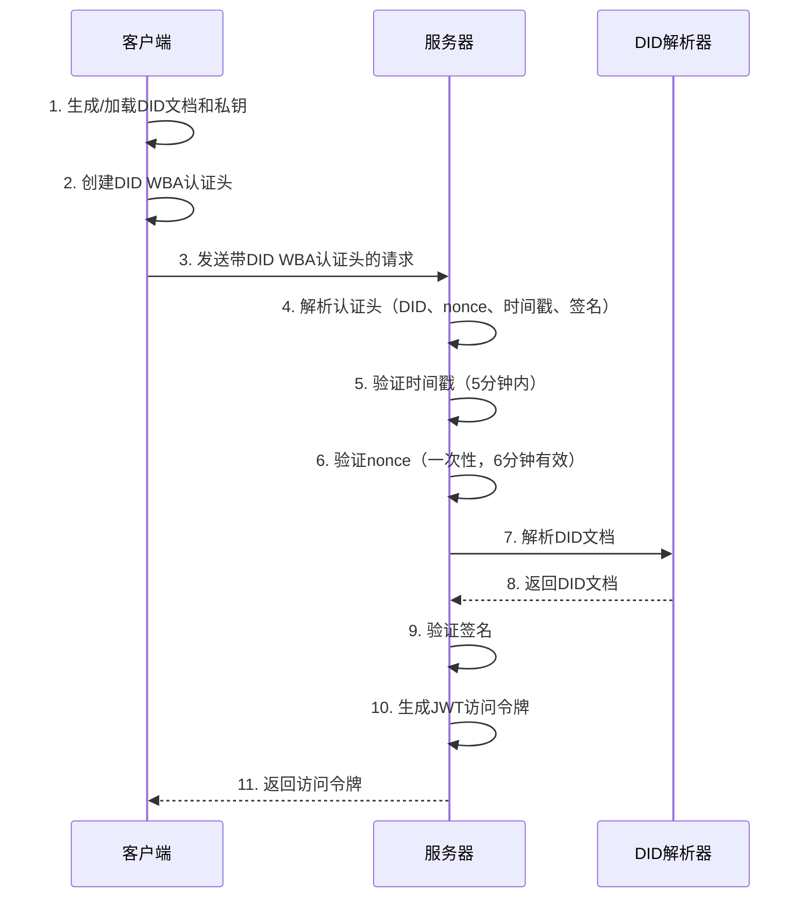
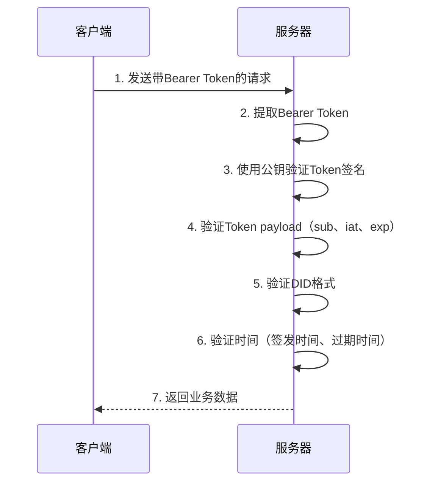
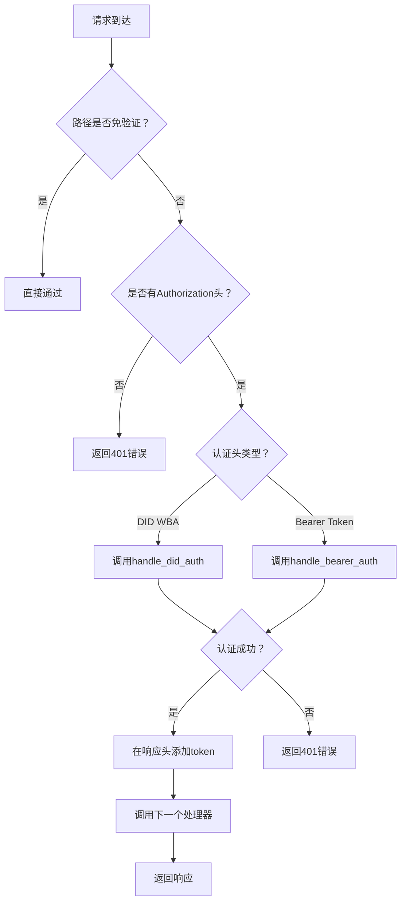

# DID WBA 系统技术说明文档

## 1. 系统概述

本系统是基于 DID WBA (Decentralized Identifier Web Based Authentication) 协议实现的身份认证解决方案，采用 FastAPI 框架构建，同时支持客户端和服务端功能。系统实现了两套身份验证机制：DID WBA 首次认证和 JWT Bearer Token 后续认证。

### 1.1 技术栈
- **后端框架**: FastAPI
- **身份认证**: DID WBA + JWT Bearer Token
- **加密算法**: RS256 (RSA with SHA-256)
- **HTTP客户端**: aiohttp
- **配置管理**: Pydantic Settings

## 2. 系统架构

### 2.1 目录结构
```
did-wba-example/
├── did_server.py           # 程序入口，支持客户端和服务端模式
├── api/                    # API路由模块
│   ├── auth_router.py      # 身份认证相关API
│   ├── did_router.py       # DID文档管理API
│   └── ad_router.py        # 广告数据API（需要鉴权）
├── auth/                   # 认证和授权模块
│   ├── did_auth.py         # DID WBA认证核心实现
│   ├── token_auth.py       # JWT Token认证
│   ├── auth_middleware.py  # 认证中间件
│   ├── custom_did_resolver.py  # 自定义DID解析器
│   └── jwt_keys.py         # JWT密钥管理
├── core/                   # 核心配置和应用初始化
│   ├── app.py              # FastAPI应用创建
│   └── config.py           # 系统配置
├── utils/                  # 工具函数
└── did_keys/               # DID文档和私钥存储目录
```

### 2.2 核心组件

#### 2.2.1 应用层 (core/app.py)
- 创建和配置 FastAPI 应用
- 注册 CORS 中间件
- 注册身份认证中间件
- 包含所有API路由

#### 2.2.2 认证层 (auth/)
- **DID认证模块**: 处理DID WBA协议认证
- **Token认证模块**: 处理JWT Bearer Token认证
- **认证中间件**: 统一处理所有请求的身份验证
- **自定义DID解析器**: 解析本地DID文档

#### 2.2.3 API层 (api/)
- **认证API**: 提供DID WBA认证和Token验证接口
- **DID管理API**: 提供DID文档的存储和获取
- **业务API**: 需要身份验证的业务接口

## 3. 客户端功能详解

### 3.1 客户端主要功能

客户端主要在 `did_server.py` 的 `client_example()` 函数中实现，包含以下功能：

#### 3.1.1 DID文档和密钥管理
```python
# 生成或加载DID文档
did_document, keys, user_dir = await generate_or_load_did(unique_id)
```

**功能说明:**
- 如果本地存在DID文档，则直接加载
- 如果不存在，则调用 `create_did_wba_document()` 生成新的DID文档和密钥对
- DID文档存储在 `did_keys/user_{unique_id}/did.json`
- 私钥存储在 `did_keys/user_{unique_id}/key-1_private.pem`

#### 3.1.2 DID WBA认证请求
```python
# 创建DID WBA认证客户端
auth_client = DIDWbaAuthHeader(
    did_document_path=str(did_document_path),
    private_key_path=str(private_key_path),
)

# 发送带DID WBA认证的请求
status, response, token = await send_authenticated_request(
    test_url, auth_client
)
```

**认证流程:**
1. 创建 `DIDWbaAuthHeader` 实例，加载DID文档和私钥
2. 调用 `get_auth_header()` 生成认证头
3. 发送HTTP请求到目标服务器
4. 接收服务器返回的访问令牌

#### 3.1.3 Token后续请求
```python
# 使用获得的token发送后续请求
status, response = await send_request_with_token(test_url, token)
```

**功能说明:**
- 使用首次认证获得的JWT token
- 在请求头中添加 `Authorization: Bearer {token}`
- 发送到同样的或其他需要认证的接口

### 3.2 客户端调用的接口

客户端主要调用以下服务端接口：

#### 3.2.1 测试认证接口
- **URL**: `GET /wba/test`
- **用途**: 测试DID WBA认证和Token认证
- **认证方式**: 支持DID WBA和Bearer Token两种方式

#### 3.2.2 DID文档存储接口 (可选)
- **URL**: `PUT /wba/user/{user_id}/did.json`
- **用途**: 将DID文档上传到服务器
- **认证方式**: 无需认证（在免验证路径列表中）

## 4. 服务端身份验证详解

### 4.1 认证中间件架构

服务端使用统一的认证中间件 `auth_middleware.py` 处理所有请求的身份验证：

```python
async def auth_middleware(request: Request, call_next: Callable) -> Response:
    """
    Authentication middleware for FastAPI.
    """
    try:
        # 验证请求身份
        response_auth = await authenticate_request(request)
        
        # 处理认证结果
        if response_auth is not None:
            response = await call_next(request)
            # 在响应头中返回token
            if response_auth.get("token_type", " ") == "bearer":
                response.headers["authorization"] = (
                    "bearer " + response_auth["access_token"]
                )
            return response
        else:
            # 免验证路径，直接通过
            return await call_next(request)
    except HTTPException as exc:
        return JSONResponse(status_code=exc.status_code, content={"detail": exc.detail})
```

### 4.2 免验证路径配置

以下路径无需身份验证：
```python
EXEMPT_PATHS = [
    "/docs",                    # API文档
    "/redoc",                   # API文档
    "/openapi.json",           # OpenAPI规范
    "/wba/user/",              # DID文档访问 
    "/",                       # 根路径
    "/agents/example/ad.json", # 代理描述文档
]
```

### 4.3 DID WBA认证实现

#### 4.3.1 认证函数入口
```python
async def handle_did_auth(authorization: str, domain: str) -> Dict:
```

**验证步骤:**

##### 步骤1: 解析认证头
```python
# 提取认证头的各个部分
header_parts = extract_auth_header_parts(authorization)
did, nonce, timestamp, verification_method, signature = header_parts
```

**作用:** 从DID WBA认证头中提取DID、nonce、时间戳、验证方法和签名

##### 步骤2: 时间戳验证
```python
def verify_timestamp(timestamp_str: str) -> bool:
    # 解析时间戳
    request_time = datetime.fromisoformat(timestamp_str.replace("Z", "+00:00"))
    current_time = datetime.now(timezone.utc)
    
    # 检查时间差是否在允许范围内
    time_diff = abs((current_time - request_time).total_seconds() / 60)
    if time_diff > settings.TIMESTAMP_EXPIRATION_MINUTES:  # 5分钟
        return False
    return True
```

**验证规则:**
- 时间戳必须在当前时间的5分钟内（配置项：`TIMESTAMP_EXPIRATION_MINUTES`）
- 防止重放攻击

##### 步骤3: Nonce验证
```python
def is_valid_server_nonce(nonce: str) -> bool:
    # 清理过期的nonce
    expired_nonces = [
        n for n, t in VALID_SERVER_NONCES.items()
        if current_time - t > timedelta(minutes=settings.NONCE_EXPIRATION_MINUTES)
    ]
    
    # 检查nonce是否已被使用
    if nonce in VALID_SERVER_NONCES:
        return False
    
    # 标记nonce为已使用
    VALID_SERVER_NONCES[nonce] = current_time
    return True
```

**验证规则:**
- 每个nonce只能使用一次
- nonce有效期为6分钟（配置项：`NONCE_EXPIRATION_MINUTES`）
- 防止重放攻击

##### 步骤4: DID文档解析
```python
# 优先使用本地DID解析器
did_document = await resolve_local_did_document(did)

# 如果本地解析失败，使用标准解析器
if not did_document:
    did_document = await resolve_did_wba_document(did)
```

**解析策略:**
- 首先尝试从本地存储解析DID文档
- 如果本地解析失败，使用标准DID解析器
- 确保DID文档的可用性

##### 步骤5: 签名验证
```python
is_valid, message = verify_auth_header_signature(
    auth_header=full_auth_header,
    did_document=did_document,
    service_domain=domain,
)
```

**验证内容:**
- 使用DID文档中的公钥验证签名
- 验证签名是否与请求内容匹配
- 确保请求的完整性和认证性

##### 步骤6: 生成访问令牌
```python
# 生成JWT访问令牌
access_token = create_access_token(data={"sub": did})

return {
    "access_token": access_token, 
    "token_type": "bearer", 
    "did": did
}
```

### 4.4 JWT Bearer Token认证实现

#### 4.4.1 Token认证函数
```python
async def handle_bearer_auth(token: str) -> Dict:
```

**验证步骤:**

##### 步骤1: Token解码和验证
```python
# 获取公钥进行验证
public_key = get_jwt_public_key()

# 解码并验证token
payload = jwt.decode(token, public_key, algorithms=[settings.JWT_ALGORITHM])
```

**验证内容:**
- 使用RSA公钥验证token签名
- 使用RS256算法（RSA with SHA-256）
- 验证token格式和完整性

##### 步骤2: Payload验证
```python
# 检查必须字段
if "sub" not in payload:
    raise HTTPException(status_code=401, detail="Invalid token payload: missing 'sub' field")
    
if "iat" not in payload:
    raise HTTPException(status_code=401, detail="Invalid token payload: missing 'iat' field")
    
if "exp" not in payload:
    raise HTTPException(status_code=401, detail="Invalid token payload: missing 'exp' field")
```

##### 步骤3: DID格式验证
```python
# 验证DID格式
did = payload["sub"]
if not did.startswith("did:wba:"):
    raise HTTPException(status_code=401, detail="Invalid DID format")
```

##### 步骤4: 时间验证
```python
# 检查token是否在将来签发（无效）
if iat > now + tolerance:
    raise HTTPException(status_code=401, detail="Token issued in the future")
    
# 检查token是否已过期
if exp <= now - tolerance:
    raise HTTPException(status_code=401, detail="Token has expired")
```

**时间验证规则:**
- Token不能在未来时间签发
- Token不能已过期
- 允许5秒的时钟偏差容忍

### 4.5 JWT密钥管理

#### 4.5.1 密钥文件路径
```python
# 私钥路径（用于签名）
JWT_PRIVATE_KEY_PATH: str = "doc/test_jwt_key/private_key.pem"

# 公钥路径（用于验证）
JWT_PUBLIC_KEY_PATH: str = "doc/test_jwt_key/public_key.pem"
```

#### 4.5.2 密钥加载函数
```python
def get_jwt_private_key() -> Optional[bytes]:
    """加载JWT私钥用于签名"""
    
def get_jwt_public_key() -> Optional[bytes]:
    """加载JWT公钥用于验证"""
```

## 5. API接口详解

### 5.1 认证相关接口

#### 5.1.1 DID WBA认证接口
- **URL**: `POST /auth/did-wba`
- **功能**: 处理DID WBA首次认证
- **输入**: DID WBA认证头
- **输出**: 访问令牌
- **验证函数**: `handle_did_auth()`

#### 5.1.2 Token验证接口
- **URL**: `GET /auth/verify`
- **功能**: 验证JWT Bearer Token的有效性
- **输入**: Bearer Token
- **输出**: 验证结果和DID信息
- **验证函数**: `handle_bearer_auth()`

#### 5.1.3 测试接口
- **URL**: `GET /wba/test`
- **功能**: 测试认证功能，支持两种认证方式
- **认证**: 必需（DID WBA或Bearer Token）
- **验证函数**: 中间件自动验证

### 5.2 DID管理接口

#### 5.2.1 获取DID文档
- **URL**: `GET /wba/user/{user_id}/did.json`
- **功能**: 获取指定用户的DID文档
- **认证**: 无需认证
- **存储路径**: `did_keys/user_{user_id}/did.json`

#### 5.2.2 存储DID文档
- **URL**: `PUT /wba/user/{user_id}/did.json`
- **功能**: 存储用户的DID文档
- **认证**: 无需认证
- **存储路径**: `did_keys/user_{user_id}/did.json`

### 5.3 业务接口

#### 5.3.1 获取广告数据
- **URL**: `GET /ad.json`
- **功能**: 获取需要认证才能访问的广告数据
- **认证**: 必需（DID WBA或Bearer Token）
- **验证函数**: 中间件自动验证

#### 5.3.2 代理描述接口
- **URL**: `GET /agents/example/ad.json`
- **功能**: 获取代理描述信息
- **认证**: 无需认证

## 6. 身份验证流程总结

### 6.1 首次认证流程（DID WBA）



### 6.2 后续认证流程（Bearer Token）



### 6.3 认证中间件处理流程



## 7. 安全特性

### 7.1 防重放攻击
- **时间戳验证**: 请求必须在5分钟内
- **Nonce机制**: 每个nonce只能使用一次，有效期6分钟
- **签名验证**: 确保请求内容未被篡改

### 7.2 加密安全
- **RSA加密**: 使用RS256算法进行JWT签名
- **私钥保护**: 私钥存储在本地文件，不对外暴露
- **分离式验证**: 使用公钥验证，私钥仅用于签名

### 7.3 访问控制
- **路径白名单**: 明确定义免验证路径
- **分层认证**: 支持两层认证机制
- **token有效期**: JWT token有60分钟有效期

## 8. 配置参数

### 8.1 服务器配置
- `LOCAL_HOST`: 本地服务器地址（默认：localhost）
- `LOCAL_PORT`: 本地服务器端口（默认：8000）
- `DEBUG`: 调试模式（默认：true）

### 8.2 JWT配置
- `JWT_ALGORITHM`: JWT算法（固定：RS256）
- `ACCESS_TOKEN_EXPIRE_MINUTES`: Token有效期（默认：60分钟）
- `JWT_PRIVATE_KEY_PATH`: 私钥文件路径
- `JWT_PUBLIC_KEY_PATH`: 公钥文件路径

### 8.3 DID配置
- `DID_DOCUMENTS_PATH`: DID文档存储路径（默认：did_keys）
- `DID_DOCUMENT_FILENAME`: DID文档文件名（默认：did.json）
- `PRIVATE_KEY_FILENAME`: 私钥文件名（默认：key-1_private.pem）

### 8.4 安全配置
- `NONCE_EXPIRATION_MINUTES`: nonce有效期（默认：6分钟）
- `TIMESTAMP_EXPIRATION_MINUTES`: 时间戳有效期（默认：5分钟）
- `MAX_JSON_SIZE`: 最大JSON大小（默认：2KB）

## 9. 运行和使用

### 9.1 启动服务器
```bash
python did_server.py
```

### 9.2 启动客户端
```bash
python did_server.py --client --port 8001
```

### 9.3 查看API文档
访问 `http://localhost:8000/docs` 查看完整的API文档。

## 10. 总结

本DID WBA系统实现了一个完整的去中心化身份认证解决方案，具有以下特点：

1. **双重认证机制**: 支持DID WBA首次认证和JWT Bearer Token后续认证
2. **安全可靠**: 实现了防重放攻击、时间戳验证、nonce机制等安全特性
3. **架构清晰**: 采用分层架构，认证逻辑与业务逻辑分离
4. **易于扩展**: 模块化设计，便于添加新的认证方式和业务接口
5. **完整示例**: 提供了客户端和服务端的完整实现示例

该系统可以作为DID WBA协议的参考实现，也可以作为构建去中心化身份认证应用的基础框架。 